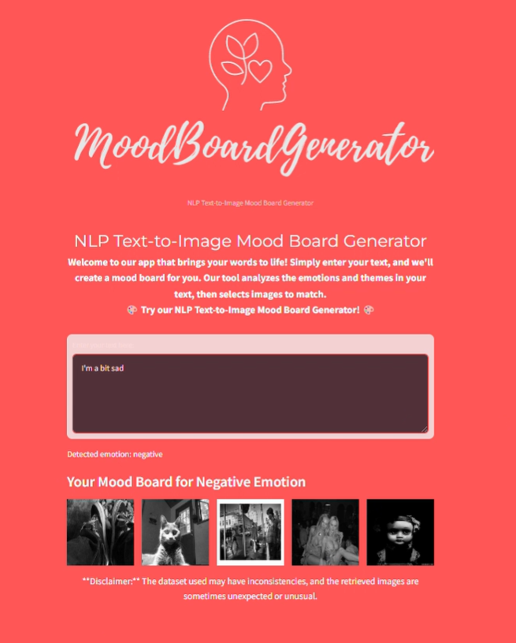

# NLP Text-to-Image Mood Board Generator
## Project Overview

 

The NLP Text-to-Image Mood Board Generator is a web application designed to analyze user-provided text for emotional content and generate a corresponding mood board with images. The project utilizes a combinantion of natural language processing (NLP) and deep learning for sentiment analysis and image retrieval.

## Project Components
The project comprises several key components:

1. Text Analysis: This module processes user input to determine the sentiment (positive, negative, or neutral) of the text. It employs natural language processing (NLP) techniques to analyze the linguistic features of the input and uses sentiment analysis algorithms to categorize the sentiment.

2. Image Retrieval: Based on the detected sentiment, this module retrieves images from a pre-labeled dataset. The images are categorized by sentiment, allowing the system to match the sentiment of the text with the appropriate visual content. The retrieval process ensures that the images align with the emotional tone of the user input.

3. Model Training and Prediction: A convolutional neural network (CNN) model is used to analyze and predict the sentiment of images in the dataset. The CNN is trained on a diverse set of images labeled with sentiment categories, enabling it to learn and generalize the features associated with each sentiment. This model enhances the accuracy of sentiment prediction for new images.

4. Streamlit Application: A user-friendly web interface built with Streamlit for interacting with the tool. This application provides a seamless experience for users to input text, view the sentiment analysis results, and see the corresponding images retrieved based on the sentiment. Streamlit's interactive elements make it easy for users to engage with the system and explore different functionalities.

## Detailed file descriptions

1. app.py
This is the main file for the Streamlit application. It includes the user interface and integrates the text analysis and image retrieval modules. Key functionalities include:

- Displaying the app's logo and titles: The application begins by displaying a logo and titles to provide a professional and welcoming introduction. The logo is centered, and the titles are styled to attract attention and provide a clear description of the app's purpose.

- Accepting user input through a text area: Users can enter text into a designated text area. This input is the basis for the subsequent analysis and image retrieval processes. The text area is designed to be user-friendly, with placeholder text and ample space for users to describe their mood or thoughts.

- Displaying the resulting mood board with images: After the user submits their text, the app analyzes the text to determine the sentiment. Based on this sentiment, it retrieves relevant images from a pre-labeled dataset. These images are then displayed as a mood board, providing a visual representation of the user's emotional state.

- Text Analysis Integration: The process_text function is called to analyze the sentiment of the user input. This function leverages natural language processing techniques to categorize the input as positive, negative, or neutral.

- Image Retrieval: The retrieve_images function retrieves images that match the detected sentiment. This function ensures that the images displayed on the mood board are appropriate and reflective of the user's emotions.

- Model Training and Prediction: A convolutional neural network (CNN) model is used to analyze and predict the sentiment of images in the dataset. This model is pre-trained and loaded when the app starts, ensuring efficient and accurate sentiment predictions.

- Interactive Elements: The Streamlit application is highly interactive, providing real-time feedback to the user. For example, when the user submits their text, a loading spinner is displayed while the text is being analyzed. Once the analysis is complete, the detected emotion and corresponding images are displayed promptly.

- User Instructions and Disclaimer: The app includes clear instructions for users, explaining how to use the text area and what to expect from the resulting mood board. Additionally, a disclaimer is provided to inform users about potential inconsistencies in the dataset and the possibility of unexpected image retrievals.

2. text_analysis.py
This file contains the function to process and analyze the text input using the VADER sentiment analysis tool from the NLTK library. It determines the sentiment of the text as positive, negative, or neutral. The core of the file is a function designed to take a piece of text as input and analyze its sentiment. This function leverages the SentimentIntensityAnalyzer to calculate sentiment scores for the text.

The most critical score is the compound score, which ranges from -1 (most negative) to +1 (most positive). The function interprets this score to determine the overall sentiment of the text:

A compound score of 0.05 or higher indicates a positive sentiment.
A compound score of -0.05 or lower indicates a negative sentiment.
A compound score between -0.05 and 0.05 indicates a neutral sentiment.

Based on the compound score, the function categorizes the text's sentiment as positive, negative, or neutral and returns this category. This categorization helps in further processing, such as retrieving relevant images based on the detected sentiment.

4. image_retrieval.py
This file handles the retrieval of images based on the sentiment detected from the user input. It randomly selects images from the dataset labeled with the corresponding sentiment. The function retrieves a list of all filenames in the images directory and shuffles this list randomly. A subset of these filenames is then selected based on the sample_size parameter. An empty list named images is initialized to store the paths of images that match the specified sentiment. If an image’s sentiment matches the specified emotion, its path is added to the images list. The function continues this process until the number of images in the images list reaches the display_size parameter.

5. image_analysis.py
This script includes the definition and training of the CNN model used for image sentiment analysis. It processes the image dataset, trains the model, and saves it for future use. Key components include:

Loading and preprocessing image data.
The image_analysis.py file begins by setting up paths and parameters necessary for processing the image dataset. It specifies the dimensions for resizing images (img_rows and img_cols) and sets the number of sentiment categories (nb_classes). The load_data() function is responsible for loading images from the specified directory, resizing them, and converting them to grayscale. This function also labels each image based on its filename, which is assumed to contain sentiment indicators like 'neg' for negative, 'pos' for positive, and 'neu' for neutral. The images are then normalized to a range of 0 to 1 by dividing by 255 and reshaped to fit the input requirements of the CNN model. The labels are converted into a categorical format suitable for training.

Defining and training the CNN model.
The core of the file is the function create_model(input_shape), which defines the architecture of the CNN model. This architecture includes convolutional layers with ReLU activation functions for feature extraction, max-pooling layers for downsampling, and dropout layers to prevent overfitting. After flattening the output from the convolutional layers, the model includes dense layers for classification, with a softmax activation function in the output layer to categorize the sentiment into one of the three classes: positive, negative, or neutral. The script then checks if a pre-trained model already exists. If a model is found, it is loaded from disk. If not, the script proceeds to load the image data, splits it into training and testing sets, and trains the newly created model using the training data. After training, the model is saved for future use, ensuring that it does not need to be retrained every time the application runs.

A function to predict the sentiment of individual images.
To make the model practical and usable within the application, the image_analysis.py file includes the analyze_image_sentiment(image_path) function. This function loads a single image, preprocesses it to match the input format expected by the CNN model, and then uses the trained model to predict the image's sentiment. The predicted sentiment is returned as a category, which can be positive, negative, or neutral. This functionality allows the application to analyze new images on the fly, enabling real-time sentiment analysis.

Model Access and Integration:
To facilitate the use of the trained model in other parts of the project, the get_model() function is provided. This function returns the loaded or trained model, making it accessible for sentiment analysis tasks elsewhere in the application. By encapsulating the model loading and retrieval process within this function, the script ensures a clean and modular design, allowing other components of the project to interact with the model seamlessly.

5. utils.py
A utility file containing the logging error function.

How to use?
-Setup: Ensure all required libraries are installed. You can use the provided requirements.txt file to install dependencies.
-Run the application: Execute app.py file using Streamlit:

```bash
streamlit run app.py 
```
-Input text: Enter any text in the provided text area. The application will analyze the text and generate a mood board based on the detected sentiment.
-View results: The mood board with corresponding images will be displayed below the text input area.

## Model details
The image sentiment analysis model is a convolutional neural network (CNN) built with TensorFlow and Keras and includes:

-Convolutional layers for feature extraction.
These layers use convolutional filters to scan the images and detect essential elements like edges, textures, and patterns. This is crucial for understanding what the images contain and their overall sentiment. The convolutional layers use ReLU (Rectified Linear Unit) activation functions, which add non-linearity to the model and help it learn more complex features.

-MaxPooling layers for downsampling.
To make the CNN more efficient and prevent it from overfitting, MaxPooling layers are used. These layers help reduce the size of the feature maps by selecting the highest value from a small region of the image, which is known as downsampling. By doing this, they effectively shrink the amount of data the model needs to process while still keeping the most important information intact. 

-Dropout layers for regularization.
To combat overfitting, Dropout layers are included in the CNN architecture. These layers work by randomly turning off a portion of the neurons in the network during each training iteration. This means that certain neurons are ignored and their contributions are temporarily removed, forcing the model to learn different paths and representations of the data. 

-Dense layers for classification.
Once the convolutional and pooling layers have done their job of extracting features from the images, the data is flattened and passed into dense, or fully connected, layers. These dense layers take all the learned features and combine them to classify the images into different sentiment categories. The final dense layer uses a softmax activation function, which generates a probability distribution across the possible sentiments, allowing the model to confidently predict the sentiment of the input image.

The model is trained on a dataset of images labeled as positive, negative, or neutral and the training process involves:

First, each image in the dataset is resized to 300x300 pixels. By this we ensure that the images are compatible with the model and makes the training process more efficient. Next, the pixel values of the images are normalized. This means that the pixel values, which typically range from 0 to 255, are scaled down to a range of 0 to 1. Normalizing the pixel values helps the model learn more effectively by providing a consistent scale of input data.

After preprocessing the images, the dataset is split into training and test. The training set is used to teach the model, while the testing set is used to evaluate how well the model has learned. This split is crucial for assessing the model's performance and ensuring that it can generalize well to new, unseen data.

The actual training of the model is carried out over 10 epochs. During each epoch, the model learns by adjusting its weights based on the errors it makes. This means that we have 10 epochs so the model goes over thetraining dataset multiple times, allowing it to fine-tune its ability to classify images as positive, negative, or neutral.


## Limitations
-Text analysis: The accuracy of text sentiment analysis depends on the context and complexity of the input. Simple statements are more likely to be accurately classified.
-Image dataset: The quality and relevance of retrieved images depend on the pre-labeled dataset. The dataset may contain images that do not perfectly match the detected sentiment.


# DISCLAIMER
The dataset used may have inconsistencies, and the retrieved images are sometimes unexpected or unusual images.  

